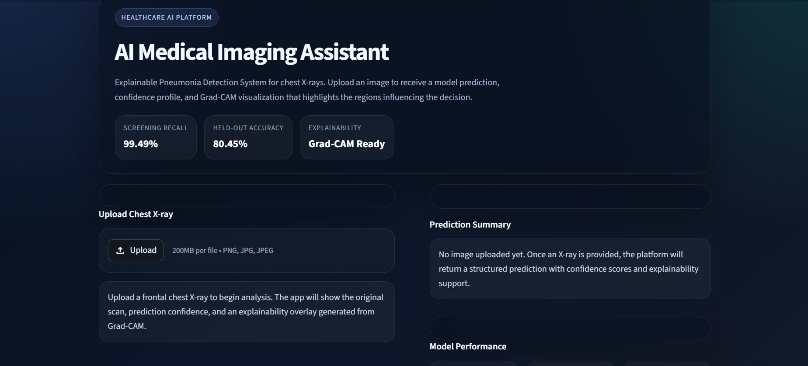
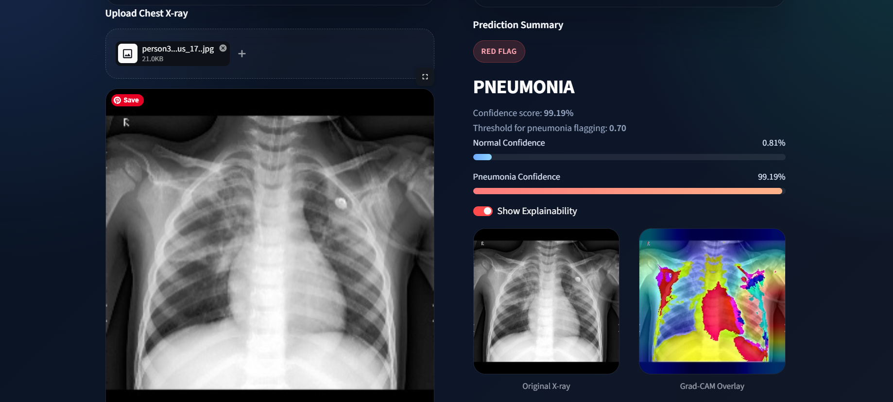
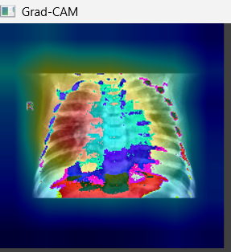

# AI Medical Imaging Assistant        [[Try the app here!]](https://brightmanmt-ai-medical-imaging-assistant-app-dk28lz.streamlit.app/)

> **Explainable pneumonia detection from chest X-rays with deep learning, decision intelligence, and production-grade UI.**


---

## 🌍 Overview

**AI Medical Imaging Assistant** is an end-to-end deep learning system designed to detect **pneumonia from chest X-ray images** while also showing **why** the model reached its decision.

This project tackles a real healthcare challenge: building AI systems that are not only predictive, but also **interpretable, safety-aware, and product-ready**. In medical settings, raw accuracy alone is not enough. A useful system must emphasize **high recall**, communicate uncertainty clearly, and provide visual evidence through explainability tools.

What makes this project stand out is the combination of:

- **Deep learning for medical image classification**
- **Transfer learning with ResNet**
- **Class imbalance handling and threshold tuning for safer decisions**
- **Grad-CAM explainability**
- **A polished Streamlit interface that feels like a real SaaS healthcare AI product**

---

## 🖼️ App Preview




## 🔥 Grad-CAM Visualization



## 📊 Model Performance

The current model is optimized for **high-recall pneumonia screening**, prioritizing missed-case reduction while maintaining a strong overall F1-score.

| Metric | Score | Interpretation |
|--------|-------|----------------|
| Accuracy | **80.45%** | Strong overall classification performance |
| Recall | **99.49%** | Extremely high sensitivity for pneumonia detection |
| Precision | **76.38%** | Some false positives remain, but screening safety is prioritized |
| F1 Score | **86.41%** | Good balance between precision and recall |

### Confusion Matrix

| Actual \ Predicted | Normal | Pneumonia |
|-------------------|--------|-----------|
| Normal | **114** | **120** |
| Pneumonia | **2** | **388** |

---

## ✨ Key Features

- **Pneumonia detection from chest X-rays** using deep learning
- **Custom CNN experimentation** alongside **ResNet transfer learning**
- **Explainable AI with Grad-CAM** to highlight influential image regions
- **Threshold tuning** to reduce unsafe decision behavior in a medical context
- **Class imbalance handling** with weighted loss
- **Evaluation with Accuracy, Recall, F1-score, Precision, and Confusion Matrix**
- **Production-style Streamlit web app** with modern UI, upload workflow, confidence display, and explainability toggle
- **CPU-friendly inference pipeline** for easy local execution

---

## 🧠 Model & Approach

### Model Exploration

This project began with a **custom CNN** to understand the task from first principles, then advanced to **ResNet18** for stronger representation learning through transfer learning.

- **Custom CNN** helped establish baseline intuition around convolutional classification
- **ResNet18** improved feature extraction by leveraging pretrained representations
- **Transfer learning** enabled faster convergence and stronger performance on limited medical imaging data

### Why ResNet?

Chest X-ray classification is visually subtle. Low-level textures and structural patterns matter, and pretrained convolutional backbones are often significantly stronger than training a small model from scratch. ResNet provides:

- deeper feature extraction
- stable optimization
- strong transfer learning performance
- a reliable base for explainability with Grad-CAM

### Class Imbalance Handling

Medical datasets are often imbalanced, and this project explicitly addresses that using:

- **class-weighted cross-entropy loss**
- **threshold tuning** instead of relying only on default `argmax`

This is important because a model trained naively may over-optimize overall accuracy while underperforming on clinically important positive cases.

### Why Recall Matters in Healthcare

In pneumonia screening, **missing a true pneumonia case** can be more dangerous than generating additional false positives.

That is why this project prioritizes:

- **high recall**
- **F1-score**
- **confusion-matrix analysis**

instead of relying only on accuracy.

---

## 📊 Results

Current model snapshot achieved approximately:

- **Accuracy:** `80.45%`
- **Recall:** `99.49%`
- **F1 Score:** `0.8641`

### Interpreting the trade-off

These results show a model optimized for **screening sensitivity**:

- it catches nearly all pneumonia cases
- it maintains a strong F1-score
- it accepts a precision trade-off to minimize missed positives

This is a realistic and important engineering decision in healthcare AI. Rather than blindly optimizing a single metric, the project demonstrates **decision-aware model design**.

---

## 🔥 Explainability (Grad-CAM)

In healthcare AI, trust matters. A prediction without context is often not enough.

This project integrates **Grad-CAM** to produce heatmaps showing which image regions most strongly influenced the model's decision. Instead of treating the network as a black box, Grad-CAM provides a visual explanation layer that helps users understand model attention.

### In simple terms

Grad-CAM works by:

- capturing activations from the final convolutional layers
- computing gradients for the predicted class
- combining them into a heatmap
- overlaying that heatmap on the original chest X-ray

This allows the system to highlight the regions that contributed most to the pneumonia prediction.

---

## 🖥️ Application UI

The project includes a **production-style Streamlit application** designed as a polished healthcare AI experience rather than a basic notebook demo.

### User workflow

- Upload a chest X-ray image
- View the scan preview instantly
- Receive a prediction: **Normal** or **Pneumonia**
- See confidence scores and threshold-aware classification
- Toggle **Grad-CAM explainability**
- Review model metrics in a clean analytics panel
- Download a prediction report

The UI is built with a strong emphasis on:

- premium dark-mode styling
- modern layout and spacing
- glassmorphism-inspired cards
- responsive split-screen design
- recruiter-quality presentation

---

## 🛠️ Tech Stack

- **Python**
- **PyTorch**
- **Torchvision**
- **Streamlit**
- **OpenCV**
- **NumPy**
- **Pillow**
- **scikit-learn**

---

## ⚙️ Installation & Usage

```bash
git clone https://github.com/your-username/ai-medical-imaging-assistant.git
cd ai-medical-imaging-assistant
pip install -r requirements.txt
streamlit run app.py
```

### Local workflow

- Train the model with `train.py`
- Best model weights are saved as `model.pth`
- Launch the app using `app.py`
- Use `gradcam.py` for explainability support

---

## 📈 Future Improvements

- Expand the training dataset for stronger generalization
- Support **multi-disease chest X-ray classification**
- Add **threshold optimization from validation curves**
- Introduce **model versioning and experiment tracking**
- Deploy to cloud for public demo access
- Add secure API endpoints for inference
- Generate downloadable PDF clinical-style reports

---

## 👨‍💻 Author

**Brightman Mutumwapavi**  
Data Science / Machine Learning  
Passionate about building AI systems that create real impact in healthcare, with a focus on **explainability, safety-aware decision making, and production-grade user experience**.

---

## ⭐ Final Note

> **This project demonstrates not just model building, but real-world AI system design with explainability and decision intelligence.**

It reflects the kind of engineering mindset required to move beyond experiments and toward **practical, interpretable, and product-ready AI solutions**.
